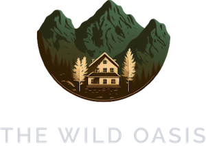
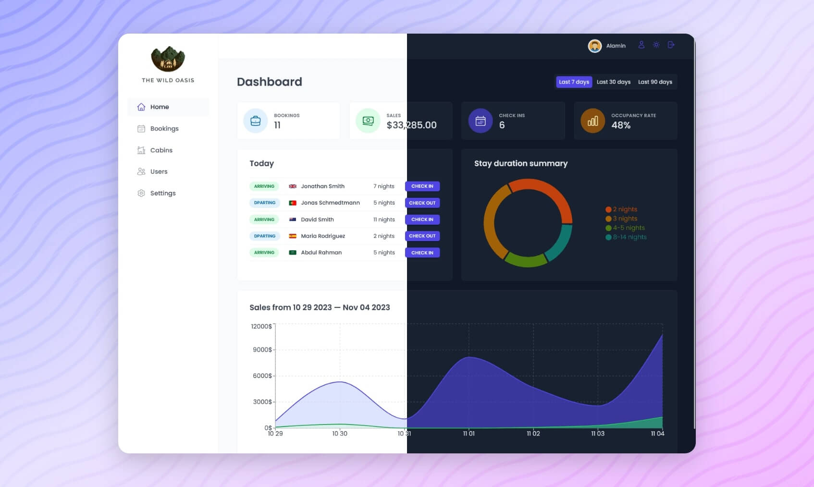
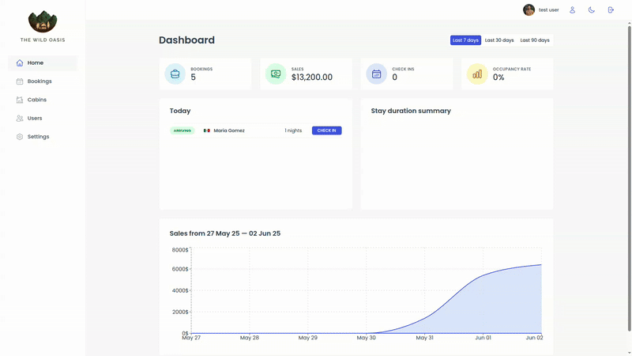
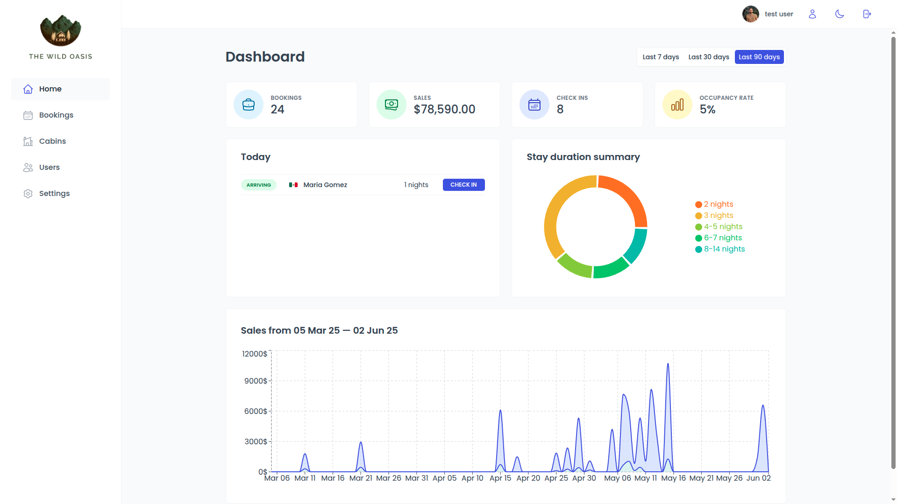
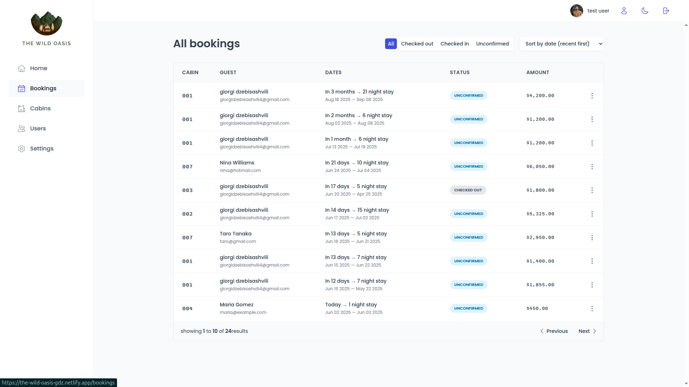
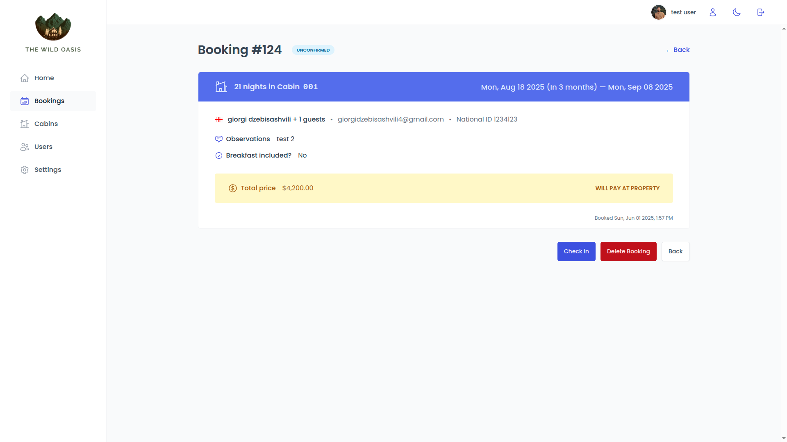
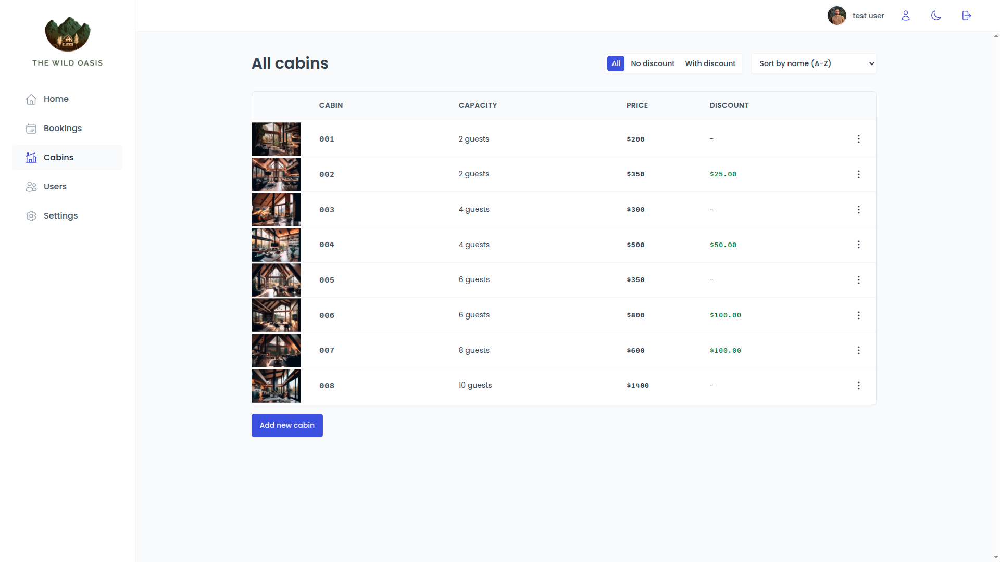

<div align="center">
  
  
  <h1>The Wild Oasis – Admin Dashboard</h1>

  <p>Hotel management interface for tracking bookings, guests, and daily operations.</p>

<a href="https://the-wild-oasis-gdz.netlify.app/"><strong>Live Demo</strong></a> •
<a href="https://github.com/giorgidzebisashvili4/the-wild-oasis">Source Code</a>

</div>

<a align="center" href="https://the-wild-oasis-alamin.vercel.app">



</a>

---

## 🧭 Overview

**The Wild Oasis Admin Dashboard** is a full-featured internal web application for managing a fictional hotel. This project focuses on CRUD operations, data visualization, and state management using modern React tools.

Originally built as part of a Udemy course, the app was enhanced and personalized to reflect real-world use cases and clean design patterns.

---

## 🚀 Features

- Authentication and route protection
- Booking management with filters and search
- Guest profiles and cabin details
- Interactive dashboard with metrics and charts
- Fully responsive UI using styled-components
- Reusable components and custom hooks

---

## 🛠️ Tech Stack

- **Frontend**: React, React Router, React Query, Styled-components
- **Backend**: Supabase (PostgreSQL + Auth)
- **Other**: React Hook Form, Toast Notifications, Chart.js

---

## 📸 Screenshots







---

## 📦 Getting Started

1. Clone the repo:
   ```bash
   git clone https://github.com/your-github-username/the-wild-oasis-admin.git
   ```
2. Install dependencies:
   ```bash
   npm install
   ```
3. Run the development server:
   ```bash
   npm run dev
   ```
4. Open [http://localhost:3000](http://localhost:3000) to see the app.

## ✍️ Credits

Originally based on a project from the Jonas Schmedtmann [Udemy course](https://www.udemy.com/course/the-ultimate-react-course). Rewritten, extended, and styled by Giorgi Dzebisashvili as a personal portfolio project.
